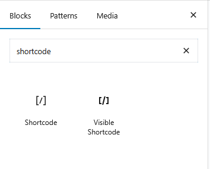
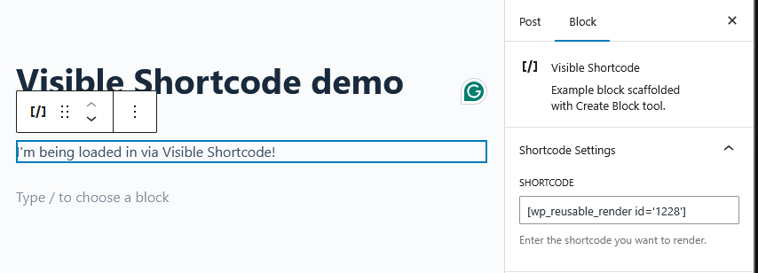

# Visible Shortcode
- Contributors:      Jack Whitworth
- Tags:              block, code, shortcode, visible, preview
- Tested up to:      6.8
- Stable tag:        1.0.0
- License:           GPL-2.0-or-later
- License URI:       https://www.gnu.org/licenses/gpl-2.0.html

Shortcodes with visible rendering in the block editor.

## Description

Add shortcode to your pages with Gutenberg with a live preview of how it'll display on the page.

Gutenberg's built-in shortcode block only shows the shotcode itself within the page editor.
Visible Shortcode uses server-side rendering to show you what your page will look like without the need to rely on previews or repeatedly saving and reloading the page in another page.

## Installation

1. Download the latest release from [GitHub]()
2. Upload the plugin files to the `/wp-content/plugins/visible-shortcode` directory, or install the plugin through the WordPress plugins screen directly.
3. Activate the plugin through the 'Plugins' screen in WordPress

## Frequently Asked Questions

### Does Visible Shortcode slow down my website?

For visitors of your website viewing the published page, no. You can expect the same performance as if you had used WordPress' default shortcode block.

Visible Shortcode uses server-side rendering within Gutenberg. This means that after the editor loads, it fetches a preview of the block's output and places it in the editor window.
This means that there's a little bit more work going on under-the-hood while editing, but unless you're using many of these blocks on one page, you shouldn't notice any impact in performance.

### Why does the preview not match the published page?

Gutenberg introduces extra CSS code to style the editing screen. This can sometimes result in elements displaying slightly differently.
Visible Shortcode can't do anything to prevent this, as it merely offers a window to display other people's code, and has no impact on the code itself.

## Screenshots

## Changelog

= 1.0.0 =
* Initial plugin release with all core features, functionality and basic documentation.
